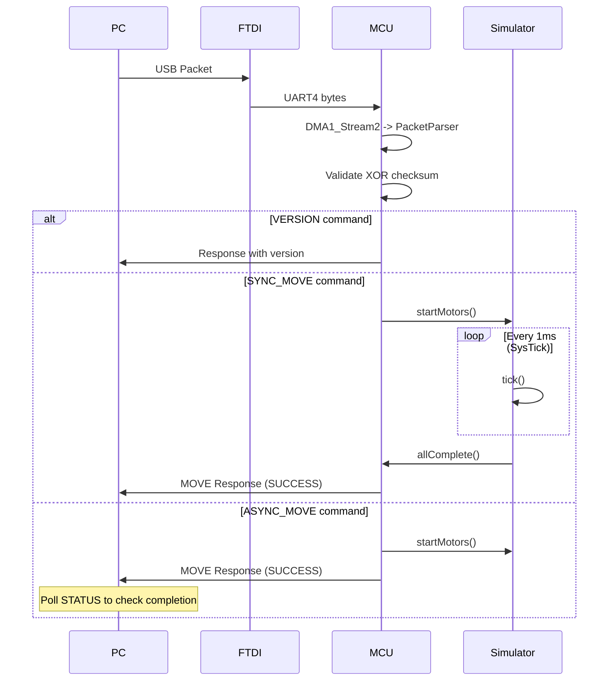

# Архитектура SQUID MCU

## Обзор системы

```
┌─────────────────────────────────────────────────────────────────┐
│                              PC                                  │
│                    MotorManagerService                          │
│                      (Python/FastAPI)                           │
└───────────────────────────┬─────────────────────────────────────┘
                            │ USB
                            ▼
┌─────────────────────────────────────────────────────────────────┐
│                         FT232RL                                  │
│                    (USB <-> UART мост)                          │
└───────────────────────────┬─────────────────────────────────────┘
                            │ UART4 (115200 baud)
                            ▼
┌─────────────────────────────────────────────────────────────────┐
│                      STM32F407VG                                 │
│                  (Центральный MCU)                              │
│                                                                  │
│  +-- DMA1_Stream2 (RX) --+    +-- SysTick (1ms) --+            │
│  |   Прием пакетов       |    |  Симуляция моторов|            │
│  +-- PacketParser -------+    +-- MotorSimulator --+            │
│                                                                  │
│  Управляет 10 подчиненными контроллерами через:                 │
│  - USART2 (данные) + CD4066BM (мультиплексирование)             │
│  - GPIO сигналы: EN, KEY, SELECT, STATUS                        │
└───────────────────────────┬─────────────────────────────────────┘
                            │ USART2
        ┌───────────────────┼───────────────────┐
        ▼                   ▼                   ▼
┌───────────────┐   ┌───────────────┐   ┌───────────────┐
│  STM32G031F8  │   │  STM32G031F8  │   │  STM32G031F8  │
│   Мотор 1     │   │   Мотор 2     │   │  ...Мотор 10  │
│               │   │               │   │               │
│ Трапецевидный │   │ Трапецевидный │   │ Трапецевидный │
│    профиль    │   │    профиль    │   │    профиль    │
└───────────────┘   └───────────────┘   └───────────────┘
```

## Поток данных



## GPIO распределение

```
┌────────────────────────────────────────────────────────────────┐
│                        STM32F407VG                              │
├────────────────────────────────────────────────────────────────┤
│  GPIOA                                                          │
│  ├── PA0 ──── UART4_TX ───► К FTDI FT232RL                     │
│  ├── PA1 ◄─── UART4_RX ──── От FTDI FT232RL                    │
│  ├── PA2 ──── USART2_TX ──► К Motor Drivers                    │
│  └── PA3 ◄─── USART2_RX ─── От Motor Drivers                   │
├────────────────────────────────────────────────────────────────┤
│  GPIOB (KEY - включение передачи данных)                        │
│  └── PB0-PB9 ──► KEY1-KEY10                                    │
├────────────────────────────────────────────────────────────────┤
│  GPIOC (EN - питание драйверов)                                 │
│  └── PC0-PC9 ──► EN1-EN10                                      │
├────────────────────────────────────────────────────────────────┤
│  GPIOD (SELECT - выбор драйвера + LED)                         │
│  ├── PD0-PD9 ──► SELECT1-SELECT10                              │
│  └── PD12-PD15 ── Status LEDs                                  │
├────────────────────────────────────────────────────────────────┤
│  GPIOE (STATUS + ENDSTOP)                                       │
│  ├── PE0-PE9 ◄── STATUS1-STATUS10 (прерывания EXTI0-9)         │
│  └── PE10-PE15 ◄── ENDSTOP1-ENDSTOP6 (аварийная остановка)     │
└────────────────────────────────────────────────────────────────┘
```

## State Machine парсера пакетов

```
                    ┌─────────────┐
                    │  WAIT_STX   │◄────────────────────────────────┐
                    └──────┬──────┘                                 │
                           │ byte == 0x02                           │
                           ▼                                        │
                    ┌─────────────────┐                             │
                    │ WAIT_LENGTH_H   │                             │
                    └──────┬──────────┘                             │
                           │                                        │
                           ▼                                        │
                    ┌─────────────────┐                             │
                    │ WAIT_LENGTH_L   │──── invalid length ─────────┤
                    └──────┬──────────┘                             │
                           │                                        │
                           ▼                                        │
                    ┌─────────────────┐                             │
                    │   WAIT_CMD      │                             │
                    └──────┬──────────┘                             │
                           │                                        │
              ┌────────────┴────────────┐                           │
              │ length == 5             │ length > 5                │
              ▼                         ▼                           │
       ┌─────────────┐          ┌─────────────┐                     │
       │  WAIT_XOR   │          │ WAIT_DATA   │                     │
       └──────┬──────┘          └──────┬──────┘                     │
              │                        │ all data received          │
              │                        ▼                            │
              │                 ┌─────────────┐                     │
              └────────────────►│  WAIT_XOR   │                     │
                                └──────┬──────┘                     │
                                       │                            │
                          ┌────────────┴────────────┐               │
                          │ XOR match               │ XOR mismatch  │
                          ▼                         └───────────────┘
                   ┌──────────────┐
                   │ PACKET_READY │
                   └──────────────┘
```

## Обработка команд

```
processPacketCommand()
        │
        ├── VERSION (0x01)
        │   └── sendVersionResponse()
        │
        ├── STATUS (0x02)
        │   └── sendStatusResponse(active, completed)
        │
        ├── STOP (0x03)
        │   ├── g_motorSimulator.stopAll()
        │   └── sendStopResponse(SUCCESS)
        │
        ├── SYNC_MOVE (0x10)
        │   ├── Validate data length
        │   ├── g_motorSimulator.startMotors()
        │   ├── while (!allComplete()) __WFI()
        │   └── sendMoveResponse(SUCCESS)
        │
        ├── ASYNC_MOVE (0x11)
        │   ├── Validate data length
        │   ├── g_motorSimulator.startMotors()
        │   └── sendMoveResponse(SUCCESS)
        │
        └── default
            └── sendErrorPacket(INVALID_COMMAND)
```

## Симуляция моторов (MotorSimulator)

```
Tick interval: 1 ms (SysTick)
Steps per tick: 1000

Example: 5000 steps = 5 ticks = 5 ms (реально ~5 секунд с текущей логикой)

                        SysTick_Handler
                              │
                              ▼
                    g_motorSimulator.tick()
                              │
              ┌───────────────┴───────────────┐
              │ for each active motor         │
              │   if (ticks[i] > 0)           │
              │     ticks[i]--                │
              │   if (ticks[i] == 0)          │
              │     completedMotors |= (1<<i) │
              └───────────────────────────────┘
```

## Приоритеты прерываний

| Прерывание | Приоритет | Описание |
|------------|-----------|----------|
| EXTI15_10 | 0 (высший) | Аварийная остановка ENDSTOP |
| EXTI0-9 | 2 | Статус моторов |
| DMA1_Stream2 | 5 | Прием данных UART4 |
| SysTick | Default | Симуляция моторов |
| DMA1_Stream6 | 7 | Передача данных USART2 |

## Технические характеристики

| Параметр | Значение |
|----------|----------|
| MCU | STM32F407VG |
| Ядро | ARM Cortex-M4 |
| Частота | 16 MHz (HSI) |
| Flash | 1 MB |
| SRAM | 192 KB |
| Макс. моторов | 10 |
| UART скорость | 115200 baud |
| Макс. размер пакета | 256 байт |
